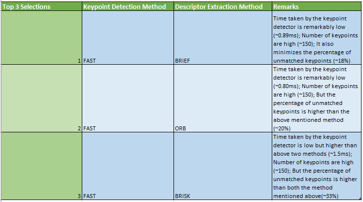

# Camera Feature Tracking and Algorithms Review


This project demonstrates multiple algorithms for detecting keypoints in an image and computing a descriptor for it. It then demonstrates how to track those features through multiple frame. The idea is to track keypoints within each bounding-box that contains an object of interest and thus compute time-to-collision (TTC) for each object as the distance between keypoints increases/decreases. 

# Project Details

## Data Ring Buffer  
I implemented a Ring Buffer for storing 'n' number of images at a time. This is very useful in the situations where you might need multiple images in the buffer at a time. It also avoids the issues of memory running over in the situations where you might use a vector and push new frames every time they are received. The Ring Buffer implementation is contained in ```ringBuffer.h```. I have implemented the following methods for the ring buffer:
 
 ```
 getSize() - for getting the number of data contained in buffer    
 push(data) - for pushing data at the top of the buffer   
 pop() - for removing the data from the top of the buffer   
 get(index) - for getting the data at index between 0 to n-1 from the buffer   
 get_ptr(index) - for getting a pointer to the data at index between 0 to n-1 from the buffer
 ```

## Keypoint Detection   
I implemented multiple keypoint detectors that can be selected based on the following keyword string inputs: ```SHITOMASI, HARRIS, FAST, BRISK, ORB, AKAZE, SIFT```. I only consider the keypoints within a certain region of interest (ROI) defined by a rectangle. Idea is to track the keypoints only within the bounding-box that contains vehicles or other objects of interest.  

## Descriptor Extraction and Matching   
I implemented multiple descriptors extractor that can be selected based on the following keyword string inputs: ```BRISK, BRIEF, ORB, FREAK, AKAZE, SIFT```. Two types matcher, ```Brute-Force``` and ```FLANN``` were implemented, and a k-Nearest Neighbor method were chosen with k=2 to select best two matches and then descriptor distance ratio test was used with the ratio being 0.8 to select the best match of two as the match. Matcher, Descriptor type and Selector can be selected using a string keyword.     


## Performance Evaluation for the Best Keypoint Detector and Descriptor Extraction algorithms  
The program was run for 10 continuous frames and keypoints within the ROI rectangle were logged and tracked through the frames. All the execution timing were logged as well. All the logs can be found as a spreadsheet in ```comparision/Feature_Tracking_Compare_Sheet.xlsx```. The average number of keypoints, matched keypoints, keypoint detection timing, and descriptor extraction timing were plotted for all the combination of keypoint detector and descriptor extractor as shown below.

  

Based on the chart, here are the top 3 choices of keypoint detector and descriptor extractor:  

 

The Keypoint Feature Detection and Tracking implemented on KITTI dataset using OpenCV library.

## Dependencies for Running Locally
* cmake >= 2.8
  * All OSes: [click here for installation instructions](https://cmake.org/install/)
* make >= 4.1 (Linux, Mac), 3.81 (Windows)
  * Linux: make is installed by default on most Linux distros
  * Mac: [install Xcode command line tools to get make](https://developer.apple.com/xcode/features/)
  * Windows: [Click here for installation instructions](http://gnuwin32.sourceforge.net/packages/make.htm)
* OpenCV >= 4.1
  * This must be compiled from source using the `-D OPENCV_ENABLE_NONFREE=ON` cmake flag for testing the SIFT and SURF detectors.
  * The OpenCV 4.1.0 source code can be found [here](https://github.com/opencv/opencv/tree/4.1.0)
* gcc/g++ >= 5.4
  * Linux: gcc / g++ is installed by default on most Linux distros
  * Mac: same deal as make - [install Xcode command line tools](https://developer.apple.com/xcode/features/)
  * Windows: recommend using [MinGW](http://www.mingw.org/)

## Basic Build Instructions

1. Clone this repo.
2. Make a build directory in the top level directory: `mkdir build && cd build`
3. Compile: `cmake .. && make`
4. Run it: `./2D_feature_tracking`.