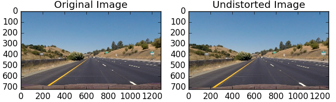
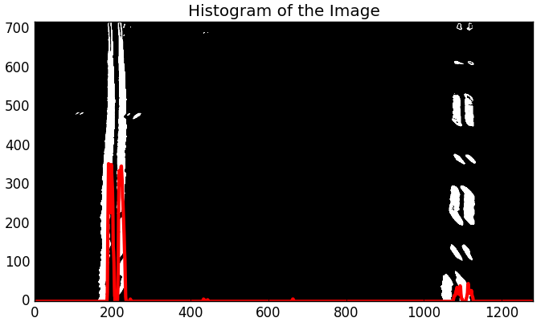
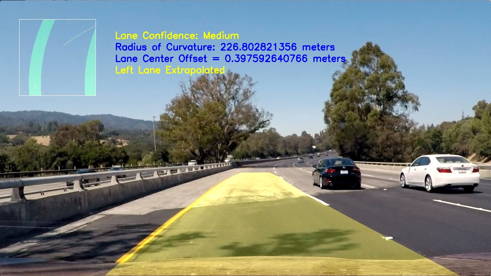

## Advanced Lane Finding

Goal of this project is to write a software pipeline to identify the lane boundaries in a video.

### Goal of the project

* Compute the camera calibration matrix and distortion coefficients given a set of chessboard images.
* Apply a distortion correction to raw images.
* Use color transforms, gradients, etc., to create a thresholded binary image.
* Apply a perspective transform to rectify binary image ("birds-eye view").
* Detect lane pixels and fit to find the lane boundary.
* Determine the curvature of the lane and vehicle position with respect to center.
* Warp the detected lane boundaries back onto the original image.
* Output visual display of the lane boundaries and numerical estimation of lane curvature and vehicle position.

The images for camera calibration are stored in the folder called `camera_cal`.  The images in `test_images` are for testing the pipeline on single frames.  

### Camera Calibration
Camera calibration was done based on the chessboard images provided in camera_cal folder. The file `imgProcessor.py` defines a class `camCalibration` which performs this calibration. Once the calibration is done, I save the Camera Intrinsics matrix and distortion coefficients to a pickle file `camera_cal/cal_data_pickle.p` to use later with my images and videos.

I start by preparing "object points", which will be the (x, y, z) coordinates of the chessboard corners in the world. Here I am assuming the chessboard is fixed on the (x, y) plane at z=0, such that the object points are the same for each calibration image.  Thus, `objp` is just a replicated array of coordinates, and `objpoints` will be appended with a copy of it every time I successfully detect all chessboard corners in a test image.  `imgpoints` will be appended with the (x, y) pixel position of each of the corners in the image plane with each successful chessboard detection.  

I then used the output `objpoints` and `imgpoints` to compute the camera calibration and distortion coefficients using the `cv2.calibrateCamera()` function.  I applied this distortion correction to the test image using the `cv2.undistort()` function and obtained this result:

  

### Pipeline (Single Frame)
#### 1. Image Undistortion
The very first step in the pipeline is to undistort the image using Camera Matrix and distortion coefficients from the file `camera_cal/cal_data_pickle.p`. Result of the undistortion is shown below.



#### 2. Image Perspective Transforms
To perform lane detection, I obtain the birds-eye view of the road and then identify each lane line. This also helps in computing the lane radius of curvature, since a straight lane line will be represented by a vertical line on the birds-eye view and curves will be easily identified.  

To perform this perspective transform, I created a class `imgUnwarper` in the `imgProcessor.py` file. The source and destination coordinates were defined as:

```python

# Grab the image shape
self.img_size = (img.shape[1], img.shape[0]) #[x, y]

# Coordinates for source image region
self.src = np.float32([[np.uint16(self.img_size[0]*0.45), np.uint16(self.img_size[1]*0.625)],
                        [np.uint16(self.img_size[0]*(1-0.45)), np.uint16(self.img_size[1]*0.625)],
                        [0, self.img_size[1]],
                        [self.img_size[0],self.img_size[1]]])
# Coordinates for destination unwarped image
self.dst = np.float32([[0, 0],
                        [self.img_size[0], 0],
                        [0, self.img_size[1]],
                        [self.img_size[0],self.img_size[1]]])
```
This resulted in the following source and destination points:

| Source        | Destination   |
|:-------------:|:-------------:|
| 576, 450      | 0, 0          |
| 704, 450      | 1280, 0       |
| 0, 720        | 0, 720        |
| 1280, 720     | 1280, 720     |

I then use the `cv2.getPerspectiveTransform(src, dst)` and `cv2.warpPerspective()` opencv functions to obtain the birds-eye view as shown below:


#### 3. Finding Lane Pixels
##### a. Color Thresholding  
I explored multiple color spaces and found out that the "S" channel of "HLS" colorspace does a good job at filtering out yellow color and "L" channel of "HLS" colorspace does a good job at filtering out white color. "LUV" is another interesting colorspace and it does a good job at detecting both yellow and white color channels. The result of these thresholdings are shown below:  

**HLS Yellow**: [H_Threshold=(15, 40), L_Threshold=(0, 255), S_Threshold=(70, 255)]  


**HLS White**: [H_Threshold=(0, 255), L_Threshold=(100, 255), S_Threshold=(0, 255)]  


**LUV**: [L_Threshold=(170, 255)]  


##### b. Edge Thresholding
I used "Sobel X Thresholding", "Sobel Magnitude Thresholding", and "Sobel Direction Thresholding" to find a combined edge image. I considered -30 to 30 degrees for the direction thresholding since in the birds-eye view a lanes will be near vertical. This is also the reason that I did not consider "Sobel Y Thresholding". For combining these edges, I considered:
```
Combined_Edge = Sobel_X_Thres OR (Sobel_Magnitude_Thres AND Sobel_Direction_Thres)
```
This results in a binary image as shown below:  


##### c. Combining Color and Edge Threshold images
I then combine color and edge images to find the final lane binary images as:
```
Lane_Binary_Image = Combined_Edge AND (HLS_Yellow_Binary OR HLS_White_Binary OR LUV_Binary)
```  
Resulting binary image is shown below:  


Looking at the thresholded images above it almost looks like color thresholding was unnecessary. But color thresholding helps a lot in situations where the road structure, or the shoulders can create an edge. An example of this is shown below:


Combining these two images would further result in a robust lane detection.

All these operations are performed by the `laneFinder` class in `imgProcessor.py`

#### 4. Fitting a polynomial for each found lane
The first step towards identifying a lane is to find the starting point for each lane. To do that, I find the histogram of binary image found above.



Left peak of the histogram corresponds to the starting point of left lane and right peak corresponds to the starting point of right lane.

Once I have identified the starting point, I divided the image into multiple verticle levels of fixed height and then found the lane center within each level. I used sliding window search method to identify lane center using convolution within a margin of previous level lane center. This can be done by convolving a window of 'ones' and an area of image identified as (Previous_Level_lane_Center +/- margin). Result of sliding window search is shown below.  


Now it is easier to fit a polynomial for this lane by using each window centers as lane center points. Assuming that `(leftx, lefty)` are the window center coordinates for the left lane and `(rightx, righty)` are the window center coordinates for the right lane, we can fit a polynomial as:

```python
# Fit a second order polynomial to each
left_fit = np.polyfit(lefty, leftx, 2)
right_fit = np.polyfit(righty, rightx, 2)
```

Once we have detected and fit a polynomial for left and right lanes, we could then just keep track of them which would save us some computation per frame. To do that, we can define a margin within which to search for lane pixels in the next frame. In the subsequent frames we can just find pixels within that window and then perform a polynomial fit. I have shown this margin window and lane pixels within that window for visualization below.  


#### 5. Finding Radius of Curvature and Lane Center Offset
  

A second order polynomial curve can be difined as: x = f(y) = Ay^2+By+C

If `mx` and `my` are the scale for the x and y axis, respectively (in meters/pixel); then the scaled parabola can be given by
```python
x = f(y) = mx / (my ** 2) *a*(y**2)+(mx/my)*b*y+c
```
`mx` can be found by measuring the number of pixels between two lanes and dividing it by the lanewidth which is usually ~3.7meters. Similarly, `my` can be found by measuring the number of pixels corresponding to the dashed portion of a lane and dividing it by the its real world length which is usually ~3meters. More information can be found [here](http://onlinemanuals.txdot.gov/txdotmanuals/rdw/horizontal_alignment.htm#BGBHGEGC).

Assuming the camera to be mounted at the center of the vehicle, we can assume that the horizontal center of the frame corresponds to center of the vehicle. Further, the average of left lane offset and right lane would give us the Lane Center offset.

#### 6. Drawing the detected lane back on the actual image
This involves inverse perspective transforms which plots the detected lane back on the actual image. I also filled the lane area using `cv2.fillPoly()` function for better visualization and printed some texts like "Radius of Curvature" and "Lane Center Offset" on the image

#### 6. Final Result
Following steps 1 through 6, I obtained a very robust lane detection as shown below.


**Things I did to improve detection**  

*Case: Loosing one lane*
1. Set a threshold for number of pixels found within the margin window. If number of pixels found was below this threshold, then I marked the lane detection to be false.
2. If one lane detection was marked as false while the other had a significant number of lane pixel thus giving us enough confidence in the lane, I performed lane extrapolation of the lower confidence lane based on a higher confidence lane assuming that both lanes are in parallel.
3. If both lane detection were marked as false then I started all over again from the sliding window approach.

*Case: One lane does not make sense*  
1. Assuming the fact that both lanes should be nearly parallel, if the distance between them starts increasing or decreasing too much, then I compare number of pixels found in each lane and declare the lane with higher number of pixel as higher confidence lane. I then extrapolate the lower confidence lane based on the higher confidence lane assuming that they are in parallel.

Result of these improvements:


In the image above, left lane could not be detected with high confidence because of the sunlight. Left lane was then extrapolated based on the right lane.

### Pipeline (Video)

For a video, each frame is extracted and the frame pipeline is used to detect lane in each frame. I also use filtering and averaging to smooth out the Polynomial fit and Radius of Curvature measurements. Here's a [link to my video result](./project_video_out.mp4)

### Discussion

The pipeline works well for most cases but does face some issues. In cases where light condition changes drastically like shadows due to trees, color filtering starts to fail and this results in misclassification of lane lines.  

Another issue was seen with edge filtering in which bad road structures like a crack on the road started triggering false lane detection.  

An ideal pipeline would contain shadow removing filter which makes the frame independent of light and then perform color+edge filtering to detect lane lines.  
