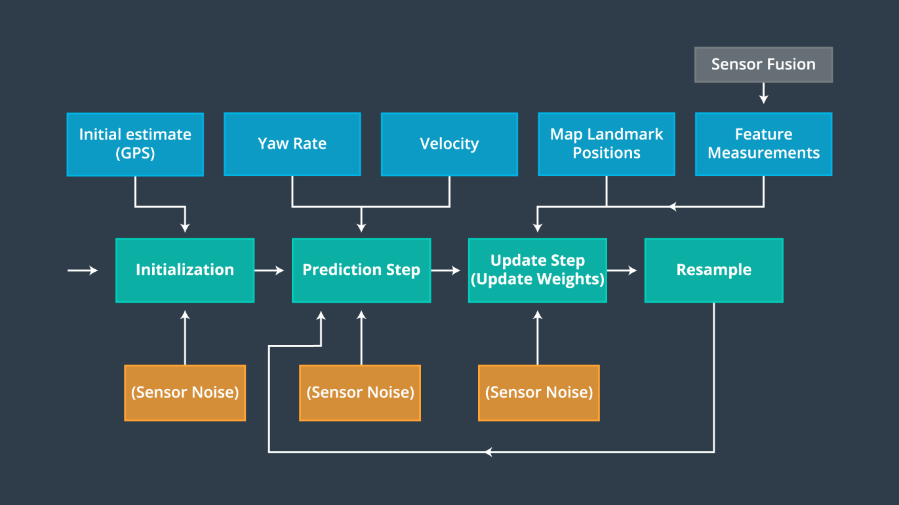

# Kidnapped Vehicle Project

## Project Introduction
Your robot has been kidnapped and transported to a new location! Luckily it has a map of this location, a (noisy) GPS estimate of its initial location, and lots of (noisy) sensor and control data.

Goal of this project is to implement a 2 dimensional particle filter in C++. The particle filter will be given a map and some initial localization information (analogous to what a GPS would provide). At each time step the filter will also get observation and control data.

## Running the Code
This project involves the Udacity Term 2 Simulator which can be downloaded [here](https://github.com/udacity/self-driving-car-sim/releases)

This repository includes two files that can be used to set up and install uWebSocketIO for either Linux or Mac systems. For windows you can use either Docker, VMware, or even Windows 10 Bash on Ubuntu to install uWebSocketIO.

Once the install for uWebSocketIO is complete, the main program can be built and ran by doing the following from the project top directory.

1. mkdir build
2. cd build
3. cmake ..
4. make
5. ./particle_filter

Alternatively some scripts have been included to streamline this process, these can be leveraged by executing the following in the top directory of the project:

1. ./clean.sh
2. ./build.sh
3. ./run.sh

Tips for setting up your environment can be found [here](https://classroom.udacity.com/nanodegrees/nd013/parts/40f38239-66b6-46ec-ae68-03afd8a601c8/modules/0949fca6-b379-42af-a919-ee50aa304e6a/lessons/f758c44c-5e40-4e01-93b5-1a82aa4e044f/concepts/23d376c7-0195-4276-bdf0-e02f1f3c665d)

Note that the programs that need to be written to accomplish the project are src/particle_filter.cpp, and particle_filter.h

Here is the main protocol that main.cpp uses for uWebSocketIO in communicating with the simulator.

INPUT: values provided by the simulator to the c++ program

// sense noisy position data from the simulator

["sense_x"]

["sense_y"]

["sense_theta"]

// get the previous velocity and yaw rate to predict the particle's transitioned state

["previous_velocity"]

["previous_yawrate"]

// receive noisy observation data from the simulator, in a respective list of x/y values

["sense_observations_x"]

["sense_observations_y"]


OUTPUT: values provided by the c++ program to the simulator

// best particle values used for calculating the error evaluation

["best_particle_x"]

["best_particle_y"]

["best_particle_theta"]

//Optional message data used for debugging particle's sensing and associations

// for respective (x,y) sensed positions ID label

["best_particle_associations"]

// for respective (x,y) sensed positions

["best_particle_sense_x"] <= list of sensed x positions

["best_particle_sense_y"] <= list of sensed y positions

So the job here is to build out the methods in `particle_filter.cpp` until the simulator output says:

```
Success! Your particle filter passed!
```

# Implementing the Particle Filter
The directory structure of this repository is as follows:

```
root
|   build.sh
|   clean.sh
|   CMakeLists.txt
|   README.md
|   run.sh
|
|___data
|   |   
|   |   map_data.txt
|   
|   
|___src
    |   helper_functions.h
    |   main.cpp
    |   map.h
    |   particle_filter.cpp
    |   particle_filter.h
```

## Inputs to the Particle Filter
You can find the inputs to the particle filter in the `data` directory.

#### The Map*
`map_data.txt` includes the position of landmarks (in meters) on an arbitrary Cartesian coordinate system. Each row has three columns
1. x position
2. y position
3. landmark id

### All other data the simulator provides, such as observations and controls.

> * Map data provided by 3D Mapping Solutions GmbH.

## Overall Procedure

The figure below shows an overall particle filter procedure.   



At the initialization step we estimate our position from GPS input. The subsequent steps in the process will refine this estimate to localize our vehicle.

During the prediction step we add the control input (yaw rate & velocity) for all particles.

During the update step, we update our particle weights using map landmark positions and feature measurements.

During resampling we will resample M times (M is range of 0 to length_of_particleArray) drawing a particle i (i is the particle index) proportional to its weight using the resampling wheel approach.

The new set of particles represents the Bayes filter posterior probability. We should now have a refined estimate of the vehicles position based on input evidence.

** In terms of coding, the pipeline goes as follows: **

 - During initialization, 100 particles are created and they are assigned a position and orientation around the initial GPS position estimate according to a normal distribution with the mean being GPS estimate and standard deviation being the GPS uncertainty.  
 - In the prediction step, the control parameters (velocity and yaw rate) are used to update position and orientation of each particle and gaussian noise is added to account for the uncertainty.
 - The update step takes the observed landmarks position and a vector of all the landmarks from the map and does the following:
    - Convert the observed landmarks position from particle's coordinate system to the world/map coordinate system.
    - Associate each observed landmark with one map landmark using nearest neighbor method.
    - Compute weight for each particle using multi-variate gaussian probability. Larger the distance between each observed landmark and its associated landmark, smaller will be the weight. For each particle compute the weight for each observed landmark and its associated map landmark and then multiply all such weights to get a final weight for the particle.  
    - Resample the particles with replacement based on its weight using the resampling wheel approach. This results in a particle to appear in the set more than once with the number of appearance being proportional to its weight. Similarly, a particle with lower weight might not appear in the set at all.  
    - The particle with highest weight is selected as the best particle and is then used to represent current location of vehicle.
