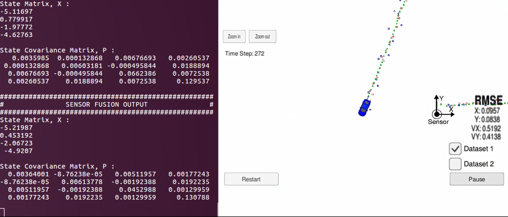

# Extended Kalman Filter Project

Purpose of this project is to utilize a kalman filter to estimate the state of a moving object of interest with noisy lidar and radar measurements. Passing the project requires obtaining RMSE values that are lower than the tolerance outlined in the project rubric.

This project involves the Udacity Term 2 Simulator which can be downloaded [here](https://github.com/udacity/self-driving-car-sim/releases)

This repository includes two files that can be used to set up and install [uWebSocketIO](https://github.com/uWebSockets/uWebSockets) for either Linux or Mac systems. For windows you can use either Docker, VMware, or even [Windows 10 Bash on Ubuntu](https://www.howtogeek.com/249966/how-to-install-and-use-the-linux-bash-shell-on-windows-10/) to install uWebSocketIO. Please see [this concept in the classroom](https://classroom.udacity.com/nanodegrees/nd013/parts/40f38239-66b6-46ec-ae68-03afd8a601c8/modules/0949fca6-b379-42af-a919-ee50aa304e6a/lessons/f758c44c-5e40-4e01-93b5-1a82aa4e044f/concepts/16cf4a78-4fc7-49e1-8621-3450ca938b77) for the required version and installation scripts.

Once the install for uWebSocketIO is complete, the main program can be built and run by doing the following from the project top directory.

1. mkdir build
2. cd build
3. cmake ..
4. make
5. ./ExtendedKF

Tips for setting up your environment can be found [here](https://classroom.udacity.com/nanodegrees/nd013/parts/40f38239-66b6-46ec-ae68-03afd8a601c8/modules/0949fca6-b379-42af-a919-ee50aa304e6a/lessons/f758c44c-5e40-4e01-93b5-1a82aa4e044f/concepts/23d376c7-0195-4276-bdf0-e02f1f3c665d)

Here is the main protcol that main.cpp uses for uWebSocketIO in communicating with the simulator.

INPUT: values provided by the simulator to the c++ program

["sensor_measurement"] => the measurement that the simulator observed (either lidar or radar)


OUTPUT: values provided by the c++ program to the simulator

["estimate_x"] <= kalman filter estimated position x  
["estimate_y"] <= kalman filter estimated position y  
["rmse_x"]  
["rmse_y"]  
["rmse_vx"]  
["rmse_vy"]  

---

## Other Important Dependencies

* cmake >= 3.5
  * All OSes: [click here for installation instructions](https://cmake.org/install/)
* make >= 4.1 (Linux, Mac), 3.81 (Windows)
  * Linux: make is installed by default on most Linux distros
  * Mac: [install Xcode command line tools to get make](https://developer.apple.com/xcode/features/)
  * Windows: [Click here for installation instructions](http://gnuwin32.sourceforge.net/packages/make.htm)
* gcc/g++ >= 5.4
  * Linux: gcc / g++ is installed by default on most Linux distros
  * Mac: same deal as make - [install Xcode command line tools](https://developer.apple.com/xcode/features/)
  * Windows: recommend using [MinGW](http://www.mingw.org/)

## Basic Build Instructions

1. Clone this repo.
2. Make a build directory: `mkdir build && cd build`
3. Compile: `cmake .. && make`
   * On windows, you may need to run: `cmake .. -G "Unix Makefiles" && make`
4. Run it: `./ExtendedKF `

## Generating Additional Data

If you'd like to generate your own radar and lidar data, see the
[utilities repo](https://github.com/udacity/CarND-Mercedes-SF-Utilities) for
Matlab scripts that can generate additional data.

## Project Instructions and Rubric

Note: regardless of the changes you make, your project must be buildable using
cmake and make!

---

# Code Specifics

### Kalman Filter Initializations

When the Sensor Fusion ProcessMeasurement() function is called the first time, The variables and matrices are initialized as follows:

**State vector, x**  
```
[1, 1, 1, 1]
```

**State covariance matrix P**  
```
[1,   0,  0,  0,   
 0,   1,  0,  0,  
 0,   0,  1000,   0,  
 0,   0,  0,  1000]  
```

**Initial transition matrix F**  
```
[1, 0, 1, 0,  
0, 1, 0, 1,  
0, 0, 1, 0,  
0, 0, 0, 1]  
```

**Process Covariance Matrix Q**  
```
[0, 0, 0, 0,  
 0, 0, 0, 0,  
 0, 0, 0, 0,  
 0, 0, 0, 0]  
 ```

**Measurement matrix, H** *(For LIDAR)*
```
[1, 0, 0, 0,
0, 1, 0, 0]
```

**Measurement matrix, H** *(For RADAR)*
```
[1, 0, 0, 0,
0, 1, 0, 0,
0, 0, 1, 0]
```

**Measurement covariance matrix, R** *(For LIDAR)*
```
[0.0225, 0,
0, 0.0225]
```

**Measurement covariance matrix, R** *(For RADAR)*
```
[0.09, 0, 0,
0, 0.0009, 0,
0, 0, 0.09]
```

### Coordinate conversion for RADAR measurements  
The RADAR measurement vector is in polar coordinates (rho, phi, rho_dot) which provides range, bearing, and radial velocity respectively. This needs to be converted to cartesian coordinates. Equations used for this conversion are:  
```
x = rho*cos(phi)
y = rho*sin(phi)
Vx = rho_dot*cos(phi)
Vy = rho_dot*sin(phi)
```

### Kalman Filter Predict and Update functions
Predict function for both RADAR and LIDAR measurements are the same since coordinate conversion is being performed for RADAR measurements. However, the update equations are different for both LIDAR and RADAR. It is due to that fact that the LIDAR measurements come in as (x, y, vx, vy) whereas the RADAR measurements come in as (rho, phi, rho_dot). Also, the traditional Kalman Filter equations can be used for the LIDAR update function but not for the RADAR update function due to the fact that the measurement matrix (H) is linear for LIDAR but non-linear for RADAR. So, we use Extended Kalman Filter (EKF) to account for this non-linearity and compute the Jacobian Matrix to linearize the measurement matrix. The non-linearity is introduce in the process of Cartesian to Polar coordinates conversions.  

### Evaluating the accuracy of Kalman Filter
The data file `obj_pose-laser-radar-synthetic-input.txt` is being used to simulate LIDAR and RADAR measurements. Each row represents a sensor measurement where the first column tells you if the measurement comes from radar (R) or lidar (L).

For a row containing radar data, the columns are: **sensor_type, rho_measured, phi_measured, rhodot_measured, timestamp, x_groundtruth, y_groundtruth, vx_groundtruth, vy_groundtruth, yaw_groundtruth, yawrate_groundtruth**.

For a row containing lidar data, the columns are: **sensor_type, x_measured, y_measured, timestamp, x_groundtruth, y_groundtruth, vx_groundtruth, vy_groundtruth, yaw_groundtruth, yawrate_groundtruth**.
```
RMSE_x = 0.0957
RMSE_y = 0.0838
RMSE_Vx = 0.5192
RMSE_Vy = 0.4138
```
Whereas radar has three measurements (rho, phi, rhodot), lidar has two measurements (x, y).
The dataset being used for this project also provides the ground truth values

I used **root mean squared error (RMSE)** to evaluate the KF. RMSE is the square root of mean of accumulated squared error.

RMSE for my filter was the following:    



In the screenshot above, Red markers are LIDAR measurements, Blue markers are RADAR measurements, and the Green markers is the position provided by Kalman Filter. It can be clearly seen that the Kalman Filter does a great job at estimating the Car's actual position.
