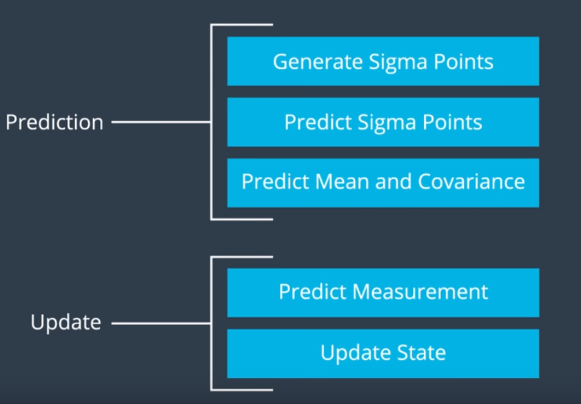
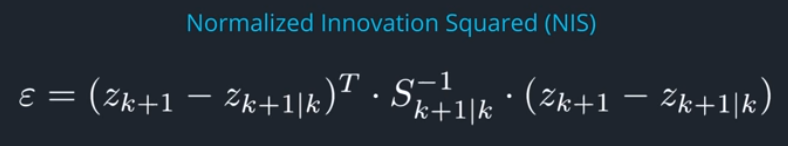
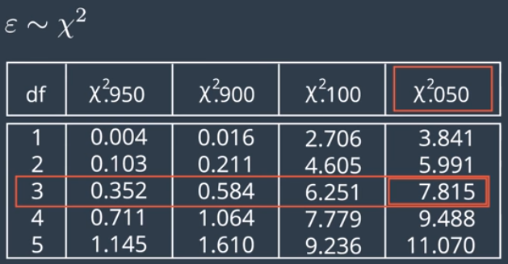
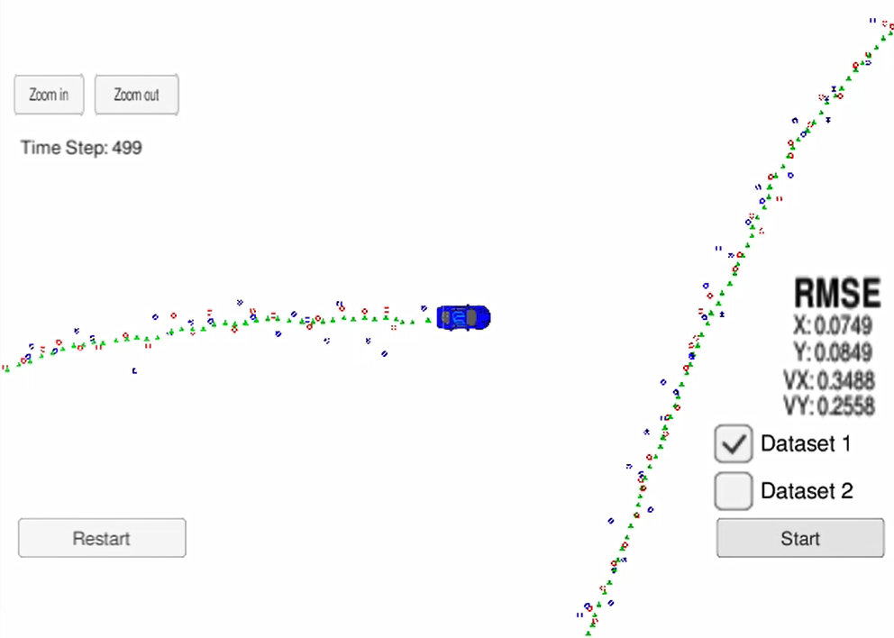

# Unscented Kalman Filter Project Starter Code

Purpose of this project is to utilize an Unscented Kalman Filter to estimate the state of a moving object of interest with noisy lidar and radar measurements.

This project involves the Term 2 Simulator which can be downloaded [here](https://github.com/udacity/self-driving-car-sim/releases)

This repository includes two files that can be used to set up and intall [uWebSocketIO](https://github.com/uWebSockets/uWebSockets) for either Linux or Mac systems. For windows you can use either Docker, VMware, or even [Windows 10 Bash on Ubuntu](https://www.howtogeek.com/249966/how-to-install-and-use-the-linux-bash-shell-on-windows-10/) to install uWebSocketIO. Please see [this concept in the classroom](https://classroom.udacity.com/nanodegrees/nd013/parts/40f38239-66b6-46ec-ae68-03afd8a601c8/modules/0949fca6-b379-42af-a919-ee50aa304e6a/lessons/f758c44c-5e40-4e01-93b5-1a82aa4e044f/concepts/16cf4a78-4fc7-49e1-8621-3450ca938b77) for the required version and installation scripts.

Once the install for uWebSocketIO is complete, the main program can be built and ran by doing the following from the project top directory.

1. mkdir build
2. cd build
3. cmake ..
4. make
5. ./UnscentedKF

Tips for setting up your environment can be found [here](https://classroom.udacity.com/nanodegrees/nd013/parts/40f38239-66b6-46ec-ae68-03afd8a601c8/modules/0949fca6-b379-42af-a919-ee50aa304e6a/lessons/f758c44c-5e40-4e01-93b5-1a82aa4e044f/concepts/23d376c7-0195-4276-bdf0-e02f1f3c665d)

Note that the programs that need to be written to accomplish the project are src/ukf.cpp, src/ukf.h, tools.cpp, and tools.h

The program main.cpp has already been filled out, but feel free to modify it.

Here is the main protcol that main.cpp uses for uWebSocketIO in communicating with the simulator.


INPUT: values provided by the simulator to the c++ program

["sensor_measurement"] => the measurment that the simulator observed (either lidar or radar)


OUTPUT: values provided by the c++ program to the simulator

["estimate_x"] <= kalman filter estimated position x
["estimate_y"] <= kalman filter estimated position y
["rmse_x"]
["rmse_y"]
["rmse_vx"]
["rmse_vy"]

---

## Other Important Dependencies
* cmake >= 3.5
  * All OSes: [click here for installation instructions](https://cmake.org/install/)
* make >= 4.1 (Linux, Mac), 3.81 (Windows)
  * Linux: make is installed by default on most Linux distros
  * Mac: [install Xcode command line tools to get make](https://developer.apple.com/xcode/features/)
  * Windows: [Click here for installation instructions](http://gnuwin32.sourceforge.net/packages/make.htm)
* gcc/g++ >= 5.4
  * Linux: gcc / g++ is installed by default on most Linux distros
  * Mac: same deal as make - [install Xcode command line tools](https://developer.apple.com/xcode/features/)
  * Windows: recommend using [MinGW](http://www.mingw.org/)

## Basic Build Instructions

1. Clone this repo.
2. Make a build directory: `mkdir build && cd build`
3. Compile: `cmake .. && make`
4. Run it: `./UnscentedKF` Previous versions use i/o from text files.  The current state uses i/o
from the simulator.

## Generating Additional Data

If you'd like to generate your own radar and lidar data, see the
[utilities repo](https://github.com/udacity/CarND-Mercedes-SF-Utilities) for
Matlab scripts that can generate additional data.

---

# Code Specifics

### Kalman Filter Initializations

Kalman Filter parameters are initialized as follows:

**State vector, x**  
```
[1, 1, 1, 1, 1]
```

**State covariance matrix P**  
```
[1,   0,  0,  0,  0,  
 0,   1,  0,  0,  0,
 0,   0,  1,  0,  0,
 0,   0,  0,  1,  0,
 0,   0,  0,  1,  0]  
```

Longitudinal acceleration process noise std deviation : **2 m/s^2**  
Yaw acceleration process noise std deviation : **0.3 rad/s^2**  
Laser measurement noise standard deviation (X position) : **0.15 m**  
Laser measurement noise standard deviation (Y position) : **0.15 m**  
Radar measurement noise standard deviation (rho) : **0.3 m**   
Radar measurement noise standard deviation (phi) : **0.03 rad**   
Radar measurement noise standard deviation (rho_dot) : **0.3 m/s**  
State dimension : **5**
Augmented State dimension : **7**
Spreading parameter (lambda) : **2**   

### Coordinate conversion for RADAR measurements  
The RADAR measurement vector is in polar coordinates (rho, phi, rho_dot) which provides range, bearing, and radial velocity respectively. This needs to be converted to cartesian coordinates. Equations used for this conversion are:  
```
x = rho*cos(phi)
y = rho*sin(phi)
Vx = rho_dot*cos(phi)
Vy = rho_dot*sin(phi)
```

### Kalman Filter Predict and Update functions
Predict function for both RADAR and LIDAR measurements are the same since coordinate conversion is being performed for RADAR measurements. However, the update equations are different for both LIDAR and RADAR. It is due to that fact that the LIDAR measurements come in as (x, y, vx, vy) whereas the RADAR measurements come in as (rho, phi, rho_dot). Also, the traditional Kalman Filter equations can be used for the LIDAR update function but not for the RADAR update function due to the fact that the measurement matrix (H) is linear for LIDAR but non-linear for RADAR. So, we use Unscented Kalman Filter (UKF) to account for this non-linearity and perform unscented transformation to approximate this arbitrary non-linear function. The non-linearity is introduced in the process of Cartesian to Polar coordinates conversions.  

For unscented transformation we choose so-called Sigma Points using the mean, covariance and spreading parameters; and then we propagate each of these sigma points through the non-linearity yielding a set of transformed sigma points. The new estimated mean and covariance are then computed based on their statistics.

The entire UKF Predict and Update can be summarized as follows:



### Tuning the parameters  
I performed consistency check in order to tune the process noise parameters. For the consistency check, I performed Normalized Innovation Squared (NIS) which follows the Chi-Squared distribution as shown in the table below:  



From the table, looking at 3 degrees of freedom for RADAR, our NIS value should go above 7.8 only 5% of the time.

### Evaluating the accuracy of Kalman Filter
The data file `obj_pose-laser-radar-synthetic-input.txt` is being used to simulate LIDAR and RADAR measurements. Each row represents a sensor measurement where the first column tells you if the measurement comes from radar (R) or lidar (L).

For a row containing radar data, the columns are: **sensor_type, rho_measured, phi_measured, rhodot_measured, timestamp, x_groundtruth, y_groundtruth, vx_groundtruth, vy_groundtruth, yaw_groundtruth, yawrate_groundtruth**.

For a row containing lidar data, the columns are: **sensor_type, x_measured, y_measured, timestamp, x_groundtruth, y_groundtruth, vx_groundtruth, vy_groundtruth, yaw_groundtruth, yawrate_groundtruth**.

Whereas radar has three measurements (rho, phi, rhodot), lidar has two measurements (x, y).
The dataset being used for this project also provides the ground truth values

I used **root mean squared error (RMSE)** to evaluate the KF. RMSE is the square root of mean of accumulated squared error.

RMSE for my filter was the following:    

```
RMSE_x = 0.0749
RMSE_y = 0.0849
RMSE_Vx = 0.3488
RMSE_Vy = 0.2558
```



In the screenshot above, Red markers are LIDAR measurements, Blue markers are RADAR measurements, and the Green markers is the position provided by Kalman Filter. It can be clearly seen that the Kalman Filter does a great job at estimating the Car's actual position.
