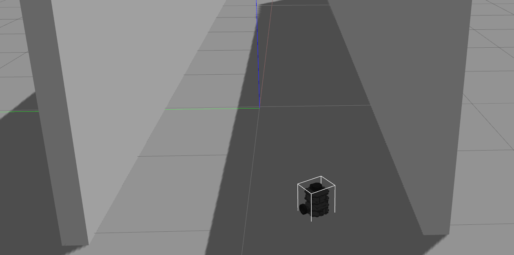
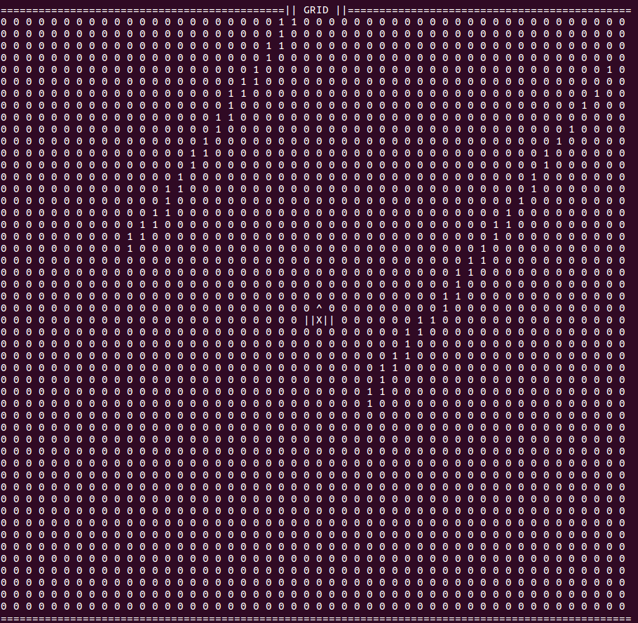
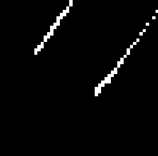
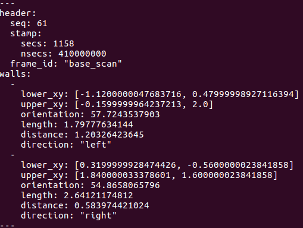
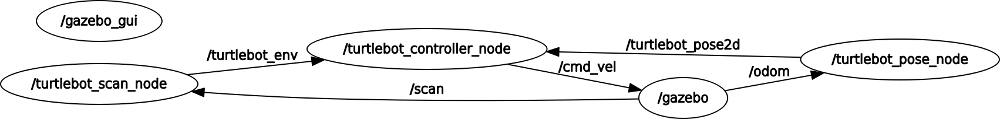
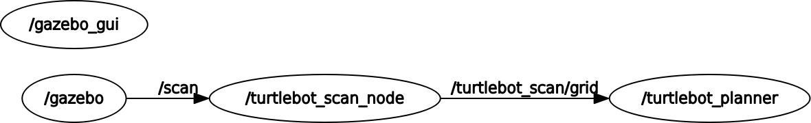
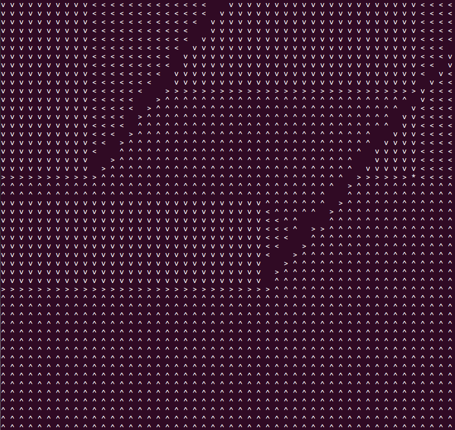
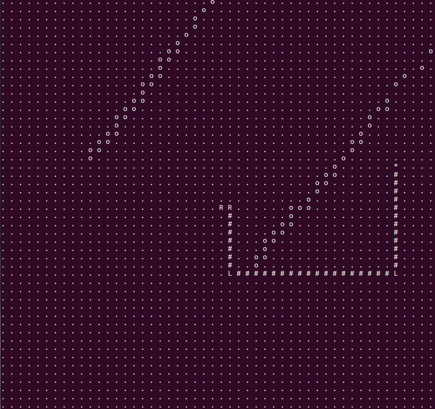

# Autonomous Navigation of TurtleBot3 in a hallway

## Problem

TurtleBot3 Burger has found itself in a hallway. We know the walls do not go on forever, but we don’t know how long they extend. Each time we run the simulation, the walls might extend a different amount. The task is to get the burger to move until the end of the hallway, turn around and return to the original position.

[TurtleBot3 e-Manual](http://emanual.robotis.com/docs/en/platform/turtlebot3/overview/)

## Challenges

1. Use the sensors to map out the environment, walls position, orientation, distance from robot and length.
2. Set the destination as the center of walls at the end of hallway (as far as the robot can see).
3. Use two controllers to control angular and linear velocity of the robot.
4. Use robot Odometry to log robot initial pose and set that as destination once the robot has reached end of hallway.

## Steps the robot should take

1. Set the destination as end of hallway and turn towards the goal.
2. Travel to the goal.
3. Set the initial pose as next destination and turn back towards the initial pose.
4. Travel to the initial pose.
5. Rotate so that its orientation matches the initial pose.

## Solution to the Challenges

#### Use the sensors to map out the environment, walls position, orientation, distance from robot and length.
 *  Node ```/turtlebot_scan_node``` is responsible for reading the robot scan topic  ```/scan``` and build a 2D top-view grid within an ROI.
 * This grid is a 50x50 matrix where 0 means navigable area and 1 corresponds to objects/non-navigable area.
 * Both walls will be represented by a line in this top-view grid.
 * Use *Probabilistic Hough Transform* to detect two lines and their end coordinates.
 * Estimate walls position, orientation, closest distance to robot, and length of walls.
 * Publish the environment info as a custom message ```/turtlebot_custom_msg/environment_msgs``` on the topic ```/turtlebot_env```
 ```
 std_msgs/Header header
    uint32 seq
    time stamp
    string frame_id
turtlebot_custom_msg/wall_obj[] walls
    float32[2] lower_xy
    float32[2] upper_xy
    float32 orientation
    float32 length
    float32 distance
    string direction
```

 <p float="left">
  <b>Robot Position and Orientation as seen in TurtleBot3 Gazebo Simulator </b></br>
  </br>
  </br><b>Top View 50x50 Grid representation of the environment </b></br>
  </br>
  </br><b>Top View 50x50 Grid representation of the environment viewed as an image in ```rqt_image_view```; topic: ```/turtlebot_env/grid``` </b></br>
  </br>

  </br><b>Walls information being published on the topic /turtlebot_env </b></br>
  </br>
</p>

#### Set the destination as the center of walls at the end of hallway (as far as the robot can see within the ROI 2D Grid).

 * ```/turtlebot_controller_node``` subscribe to the topic ```/turtlebot_env``` and sets the center of far end of two walls as the destination coordinates.

#### Use two controllers to control angular and linear velocity of the robot.

 * Simplify the problem by restricting the robot to only forward movement and anglular turn (about z-axis).
 * Create two simple PID controllers *(definitions at src/pid.c and include/pid.h)* ; one for controlling linear velocity and one for controlling angular velocity.
 * Linear Velocity PID uses *distance to destination* as the error term and Anbular Velocity PID uses *theta error* as the error term.
 * The reference desired orientation works as follows: 0 degrees corresponds to no turn, +ve angle corresponds to a clockwise turn; -ve angle corresponds to anti-clockwise turn.
 * The angluar orientation of robot however follows the right-hand rule about z-axis; meaning a +ve angular velocity will rotate the robot anti-clockwise and a -ve angular velocity will rotate the robot clockwise.
 * Multiply the output of Angular velocity PID by *-1.0* and then create a ```geometry_msgs/Twist``` message with desired linear and angular velocity and publish on ```/cmd_vel``` topic which in-turn controls the robot.

#### Use robot Odometry to log robot initial pose and set that as destination once the robot has reached end of hallway.

 * ```/turtlebot_pose_node``` subscribes to the topic ```/odom``` and does the necessary Quaternion to Euler coordinate transforms to obtain robot absolute orientation.
 * This node forms a ```geometry_msgs/Pose2D``` message with robot (x, y, theta) and publishes over ```/turtlebot_pose2d``` topic.
 * ```/turtlebot_controller``` subscribes to ```/turtlebot_pose2d``` node to log robots initial pose and the robot's pose when it reaches the end of hallway.
 * ```/turtlebot_controller``` uses both pose to determine required degree of turn and sets the destination as initial pose.

#### The complete rosgraph is shown below



#### Possible Improvements

 * Build a map using [SLAM](http://emanual.robotis.com/docs/en/platform/turtlebot3/slam/)
 * Use any simple path planning algorithm like **Dynamic Programming**, **A* ** or **Hybrid A* ** to compute the path to a set destination.
 * Generate a trajectory to follow in order to reach to the goal.
 * Implement a **waypoint follower** to output lateral and longitudinal steering values to follow the said trajectory.

#### Simple Path Planning Demonstration

 * Dynamic Program Algorithm was used for this Path Planning Demo.
 * The ```/turtlebot_scan``` node publishes the 2D Grid as a ```sensor_msgs/Image``` message over the ```/turtlebot_scan/grid``` topic.
 * Node ```/turtlebot_planner``` subscribes to this message and uses it to plan an optimum path to the goal.
 * The rosgraph is shown below.
  

 * Optimum Policy can be described as a policy (about which direction to go to) thats defined for each cell in a grid. i.e. given the goal, if robot finds itself in any cell within the grid, this policy defines the direction it should travel to. An example for the above case is shown below for goal (x, y) = (45, 20).
  

 * Optimum Path can be described as the shortest the robot should take to reach to the goal. An example for the above case is shown below for robot position as the center of the grid i.e. (x, y) = (25, 25) and goal (x, y) = (45, 20). While describing the path, symbols [R, #, L] are used which corresponds to (Turn Right, Go Straight, Turn Left).
 

 * Note: This demo is shown in a discrete world with discrete robot movements. The world however is continuous and a different algorithm like Hybrid A* should be applied for planning the trajectory to the goal.

### Setup Instructions

 * Set up ROS-KINETIC with TurtleBot3
 ```
 sudo apt-get update
 sudo apt-get upgrade
 wget https://raw.githubusercontent.com/ROBOTIS-GIT/robotis_tools/master/install_ros_kinetic.sh && chmod 755 ./install_ros_kinetic.sh && bash ./install_ros_kinetic.sh

 sudo apt-get install ros-kinetic-joy ros-kinetic-teleop-twist-joy ros-kinetic-teleop-twist-keyboard ros-kinetic-laser-proc ros-kinetic-rgbd-launch ros-kinetic-depthimage-to-laserscan ros-kinetic-rosserial-arduino ros-kinetic-rosserial-python ros-kinetic-rosserial-server ros-kinetic-rosserial-client ros-kinetic-rosserial-msgs ros-kinetic-amcl ros-kinetic-map-server ros-kinetic-move-base ros-kinetic-urdf ros-kinetic-xacro ros-kinetic-compressed-image-transport ros-kinetic-rqt-image-view ros-kinetic-gmapping ros-kinetic-navigation ros-kinetic-interactive-markers

 cd ~/catkin_ws/src/
 git clone https://github.com/ROBOTIS-GIT/turtlebot3_msgs.git
 git clone https://github.com/ROBOTIS-GIT/turtlebot3.git
 cd ~/catkin_ws && catkin_make

 # get simulator
 cd ~/catkin_ws/src
 git clone https://github.com/turtlebot/turtlebot_simulator.git
 ```

* Useful Turtlebot Commands / Topics

  ```
  # Environment variables
  source /opt/ros/kinetic/setup.bash
  source ~/catkin_ws/devel/setup.bash
  export TURTLEBOT3_MODEL=burger

  # Launch turtlebot_gazebo
  roslaunch turtlebot3_gazebo turtlebot3_world.launch

  # Visualize turtlebot in rviz
  roslaunch turtlebot3_gazebo turtlebot3_gazebo_rviz.launch

  # Move turtlebot using keyboard
  roslaunch turtlebot3_teleop turtlebot3_teleop_key.launch

  ## Relevant topics
  # Laser scans
  topic: scan; msg_type: sensor_msgs/LaserScan

  # Linear and Angular Velocity Commands
  topic: /cmd_vel; msg_type: geometry_msgs/Twist

  # Current pose
  topic: /odom; msg_type: nav_msgs/Odometry
  ```

* Running this project
  1. Get the world file and launch file from ```resources/row.world``` and ```resources/turtlebot3_world.launch```.
  2. Copy the world file to ```/opt/ros/kinetic/share/turtlebot3_gazebo/worlds/```
  3. Copy the launch file to ```/opt/ros/kinetic/share/turtlebot3_gazebo/launch/```
  4. Run the simulator

    ```
    # Environment variables
    source /opt/ros/kinetic/setup.bash
    source ~/catkin_ws/devel/setup.bash
    export TURTLEBOT3_MODEL=burger

    # Launch turtlebot_gazebo
    roslaunch turtlebot3_gazebo turtlebot3_world.launch
    ```

  5. Run the controller node in another terminal

    ```
    # Environment variables
    source /opt/ros/kinetic/setup.bash
    source ~/catkin_ws/devel/setup.bash
    export TURTLEBOT3_MODEL=burger

    # Launch the controller node
    roslaunch turtlebot_controller turtlebot_controller.launch
    ```

  6. Run the path planning demo

    ```
    # Environment variables
    source /opt/ros/kinetic/setup.bash
    source ~/catkin_ws/devel/setup.bash
    export TURTLEBOT3_MODEL=burger

    # Launch the controller node
    roslaunch turtlebot_planner turtlebot_planner.launch
    ```
