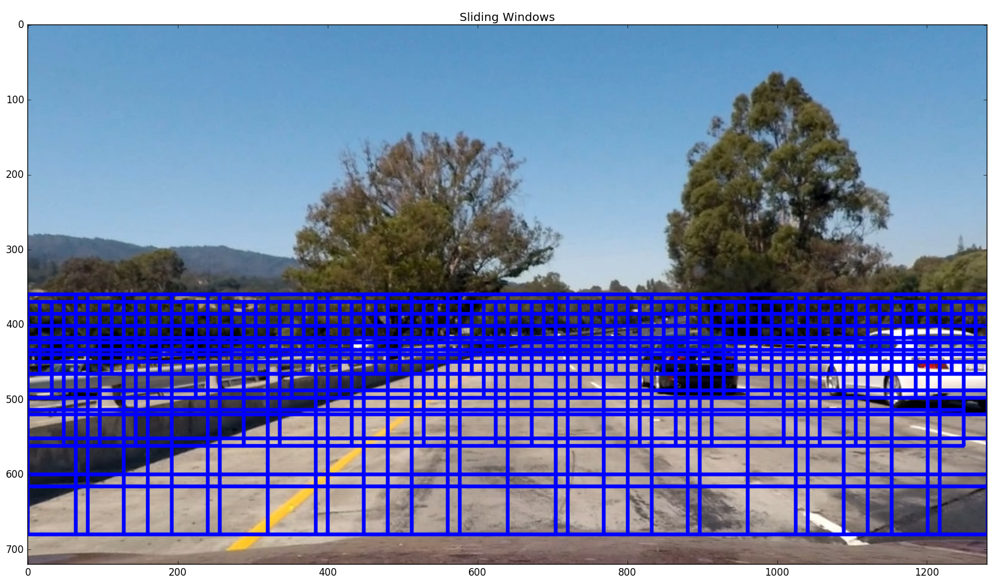
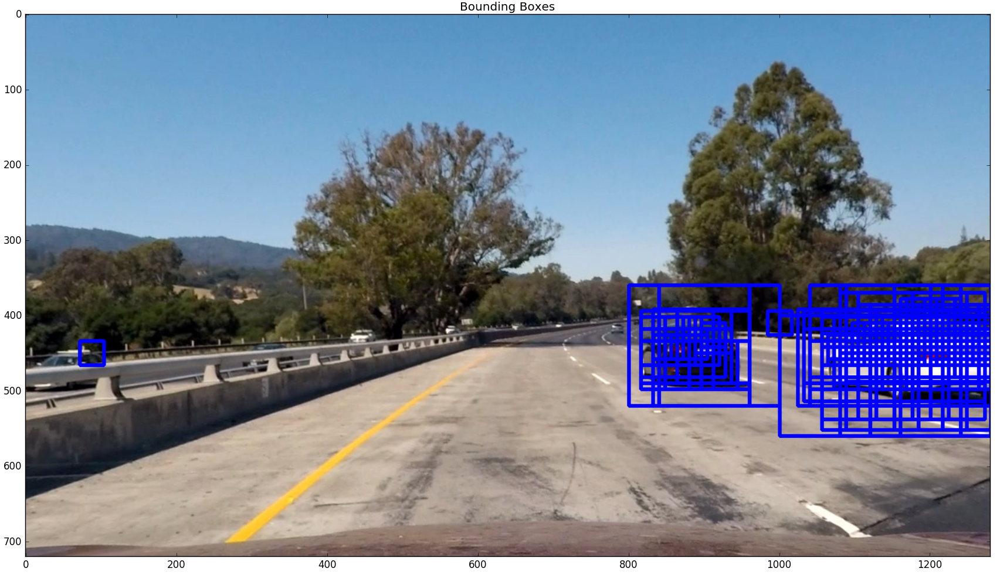
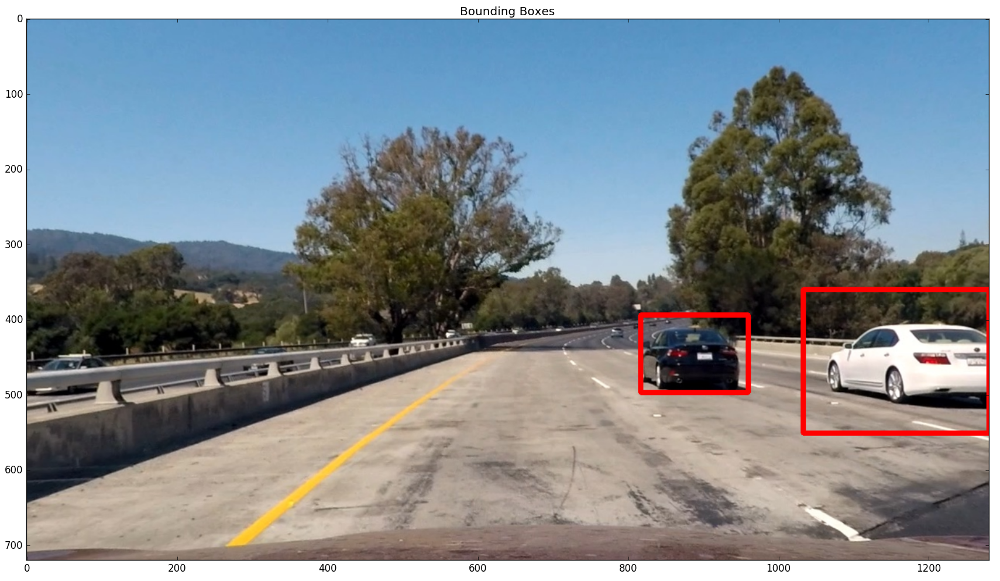

# Vehicle Detection  

The goals / steps of this project are the following:

* Perform a Histogram of Oriented Gradients (HOG) feature extraction on a labeled training set of images and train a classifier Linear SVM classifier
* Optionally, you can also apply a color transform and append binned color features, as well as histograms of color, to your HOG feature vector.
* Implement a sliding-window technique and use your trained classifier to search for vehicles in images.
* Run your pipeline on a video stream (start with the test_video.mp4 and later implement on full project_video.mp4) and create a heat map of recurring detections frame by frame to reject outliers and follow detected vehicles.
* Estimate a bounding box for vehicles detected.

## [Rubric](https://review.udacity.com/#!/rubrics/513/view) Points
### Here I will consider the rubric points individually and describe how I addressed each point in my implementation.  

---
## Pipeline

### Classifier   
I used Support Vector Machine (SVM) method of supervised learning for classification between car or non-car. I extracted spatial bins, histogram bins, and Histogram of Gradient (HoG) features from the image for training and classification. These features were converted to scalar for the SVM classifier.

I used GridSearchCV() function from sklearn.model_selection to find the best parameter values for SVM. The parameter ranges provided were {'kernel':('linear', 'rbf'), 'C':[1, 10], 'gamma':[0.1, 10]}.

### Image features
#### Spatial binning
I used YCrCb colorspace to get 32x32 spatial binned image features and then used NumPy's ravel() function to flatten them into a 1D array.

#### Color Histogram
I used the histogram of Y channel of image in YCrCb colorspace as another feature. Numbers of bins used were 32.

#### Histogram of Oriented Gradient (HOG)
Third feature used was HOG for Y channel of YCrCb colorspace, for which the parameters used were: 11 Orientations, 16 Pixels per cell, 2 Cells per block.

These three features were concatenated and then applied a sklearn.preprocessing.StandardScaler() fit to get uniform distribution of dataset.

I tried different combinations of parameters and finally realized that the following parameters worked the best.  

| Parameter       | Value          |
| --------------- |:--------------:|
| Color Space     | YCrCb          |
| Color channel   | Y              |
| orientations    | 11             |
| Pixels Per Cell | 12             |
| Cells per block | 2              |
| Spatial Size    | 32x32          |
| Histogram Bins  | 32             |

### Sliding Window Search

I used 5 different sizes of windows for the sliding window search. Smaller windows near horizon and bigger windows closer to the camera as shown below.

   

Scales used for these windows are (Lines 209-237 of vehicleDetection.py):

| Scale       | y_start  | y_end |
| --------------- |:--------------:|:--------------:|
| 0.5   | 370   | 470 |
| 1     | 370   | 500 |
| 1.5   | 370   | 600 |
| 2     | Height/2  | Height  |
| 2.5   | Height/2  | Height  |  

Overlap between sliding window was selected as one cell (Line 86 of vehicleDetection.py).

The detections such resulted provides many false positives. One way to get rid of false positive is to consider the area with multiple overlapping detection windows. Detection obtained from sliding windows are shown below:

  

To reject the area with few overlapping window, I first generated a heatmap which is basically number of overlapping window for each pixel in the image (function 'add_heat()'), and then applied a threshold to make heat of pixels with less number of overlapping windows equal to zero. Figure below shows thresholded heatmap for the image shown above.    

  

I further labelled the connected regions in heatmap using scipy.ndimage.measurements.label() function and drew bounding boxes around the labelled region (Function 'draw_labeled_bboxes()'). Result of this step is shown below.

These steps forms the basis of vehicle detection in each frame and was used in video pipeline for processing both 'test_video.mp4' and 'project_video.mp4' files provided with the project.

### Discussion

#### Issues faced in the implementation of this project.

Some false detections were seen even after heatmap thresholding which could most likely be avoided by tracking the position of each vehicle and predicting their next position. Any outliers could then be just neglected. Another drawback of this approach would be that this would classify any 'vehicle-like' looking object as vehicle. For example, it was seen to classify a sign board as a car.
